# Covid Busters
I made Covid Busters for my Web Development II class during the fall of 2020.

The purpose of this website is to help people register for their Covid-19 vaccination.

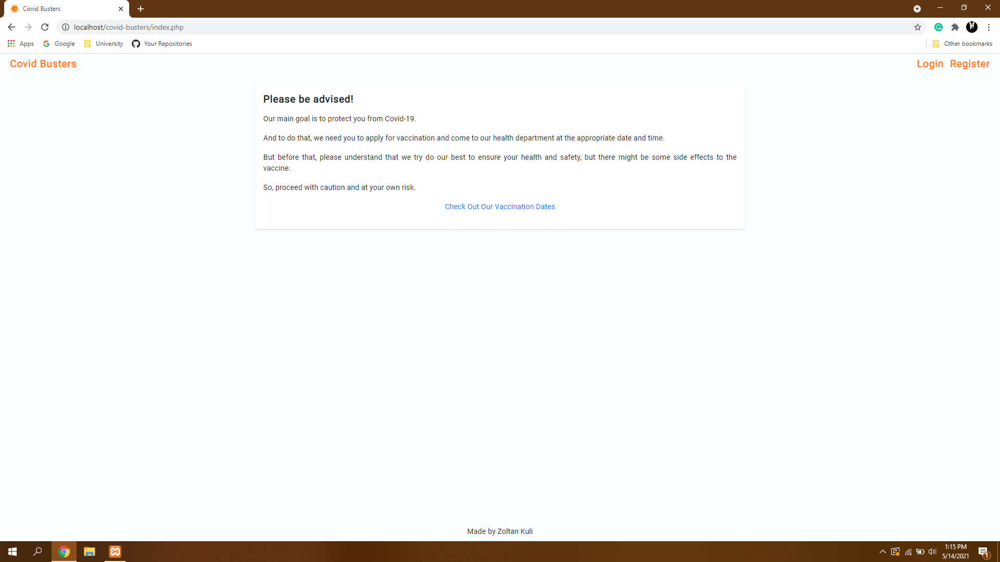
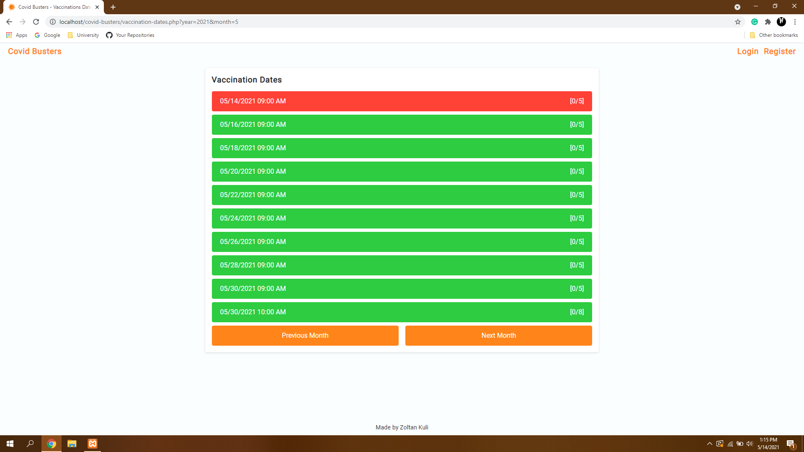
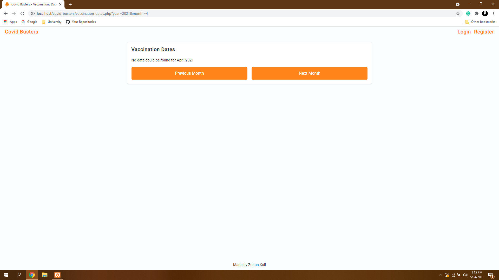
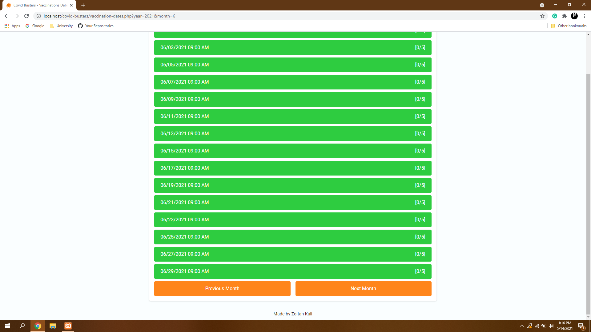
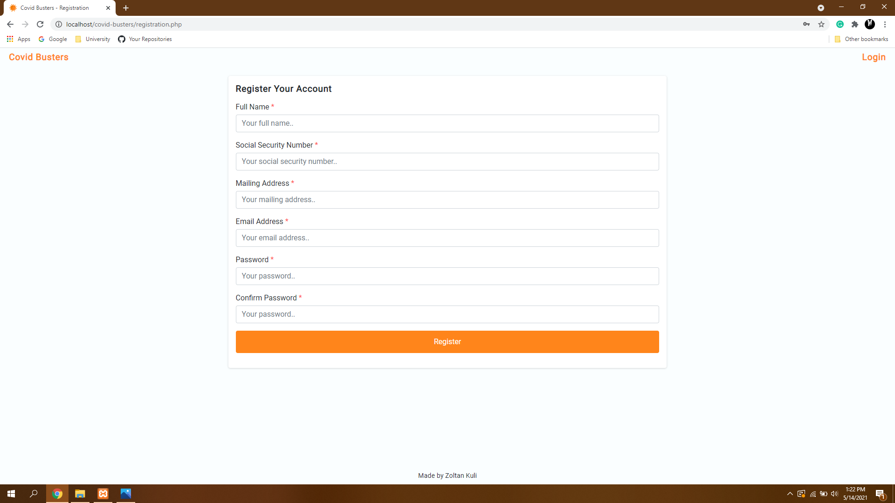

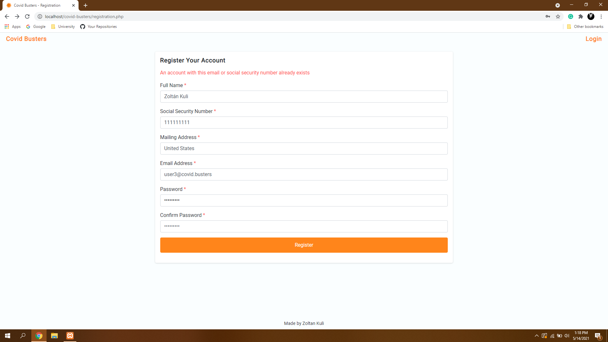
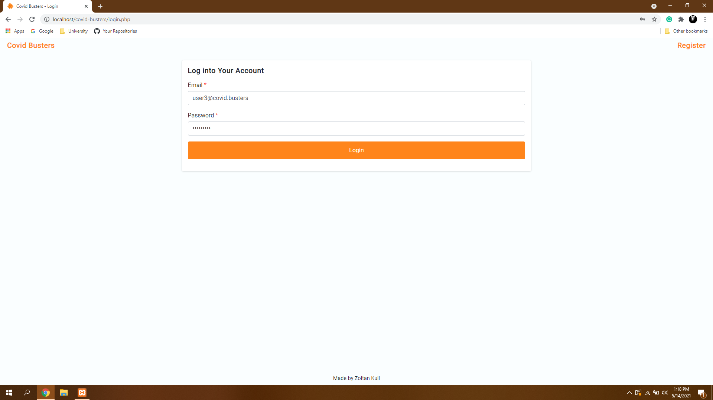

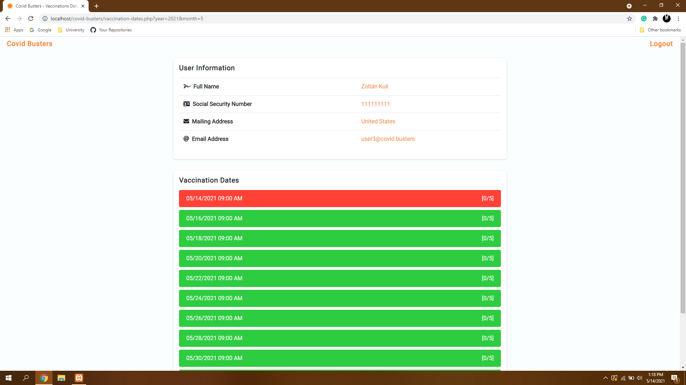
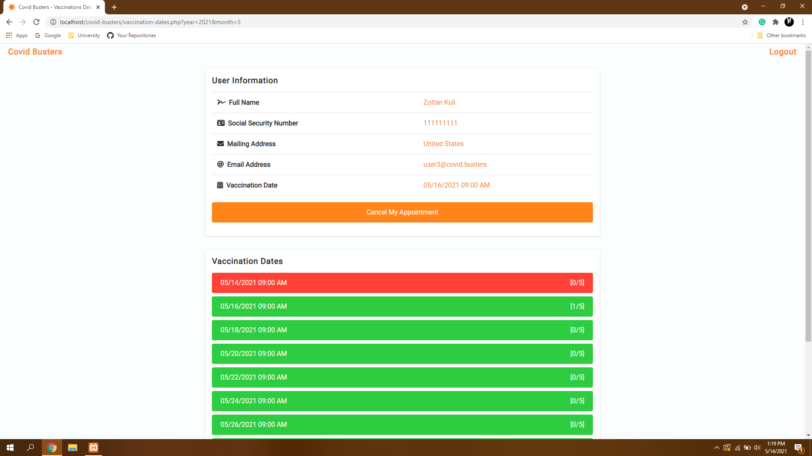

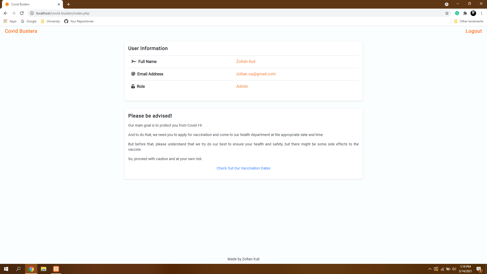
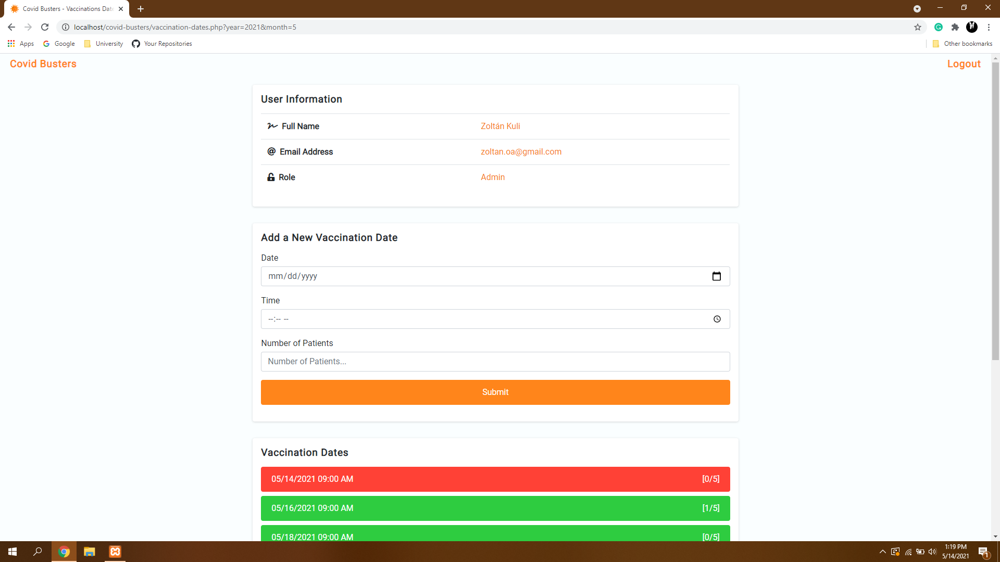
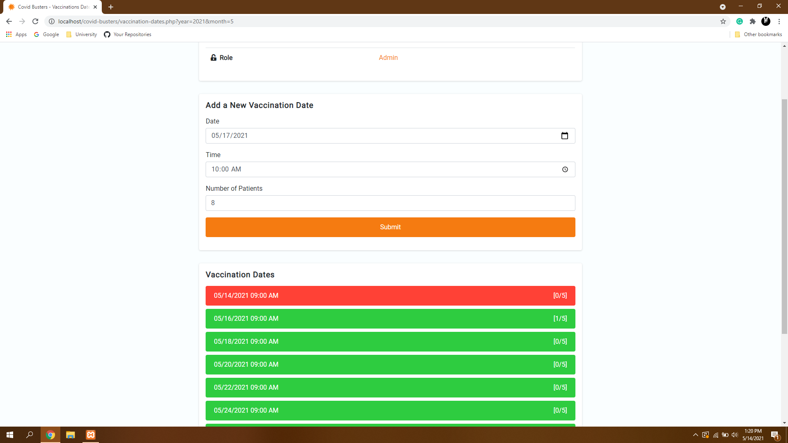
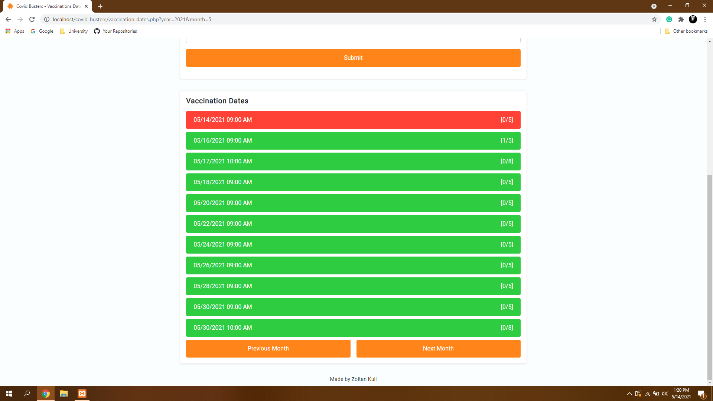
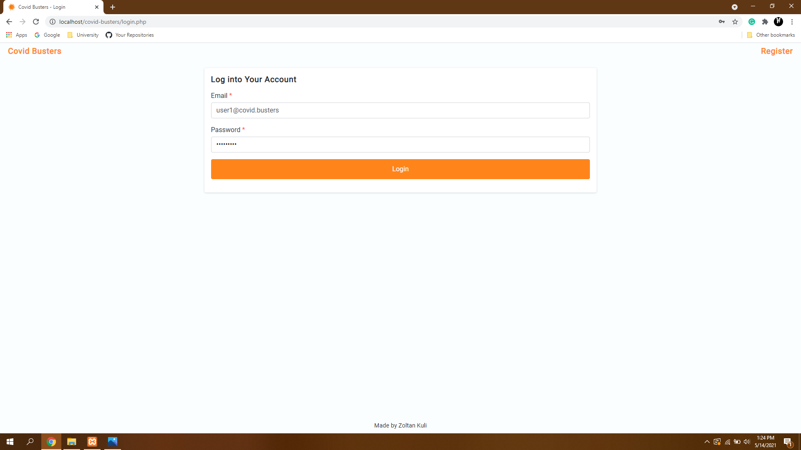
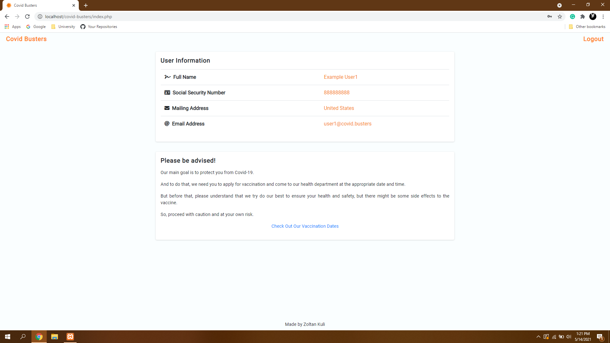
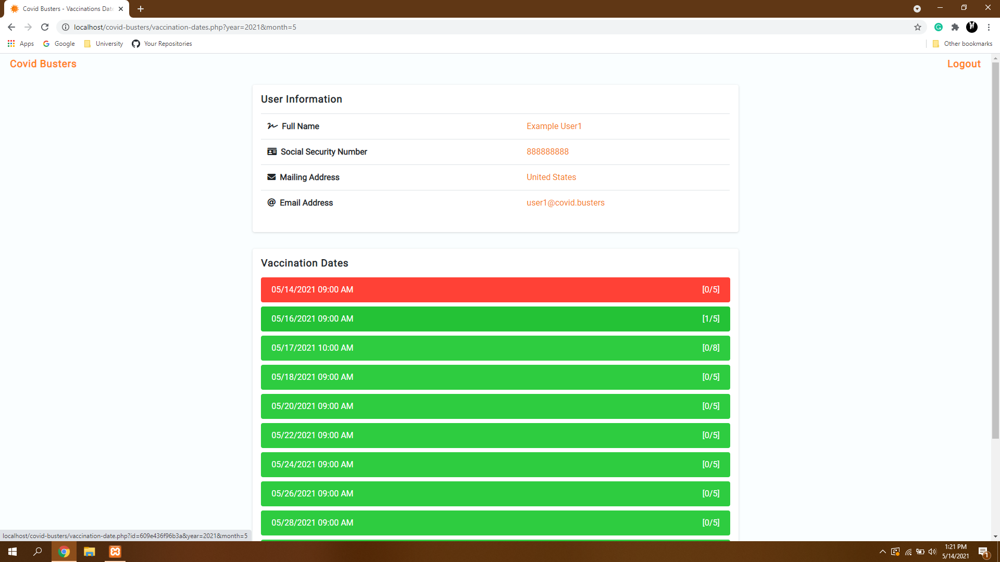
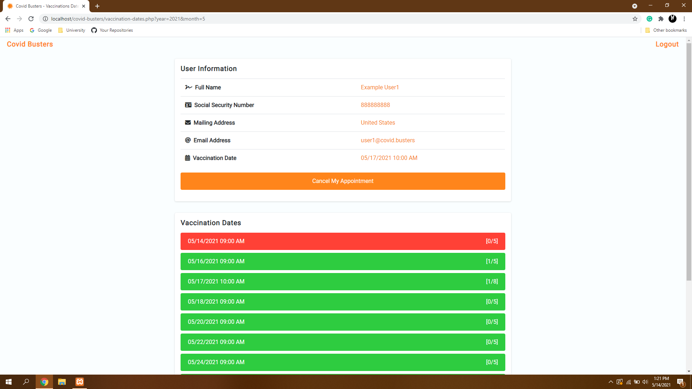

# Highlights
* Created a responsive website with Bootstrap.
* Built a PHP- and JSON-based system that users can use to create an account and log in.
* Implemented admin features that enable the admins to create new vaccination dates.
* Implemented user features that enable the users to register for vaccination or cancel it.

# Technologies Used
* PHP
* JSON
* HTML
* CSS
* Bootstrap
